# kku-Ballot / ethereum-supply-chain

## การ Deploy smart contract บน Binance Smart Chain

 

### การตั้งค่าเริ่มต้น

1) เลือกใช้ Node version 12.19.0 / Truffle v5.2.2

2) เข้าไปยัง Directory ของโปรเจค เช่น 

`cd voting/` หรือ
`cd ethereum-supply-chain/`   

3) ติดตั้ง package ที่จำเป็นโดยพิมพ์คำสั่ง  

`npm install`  

### การสร้าง Wallet เพื่อใช้ในการ Deploy smart contract

1) ไปยังเว็บไซต์ 
[vanity-eth](https://vanity-eth.tk/) เพื่อสร้าง Private key และ Public key  

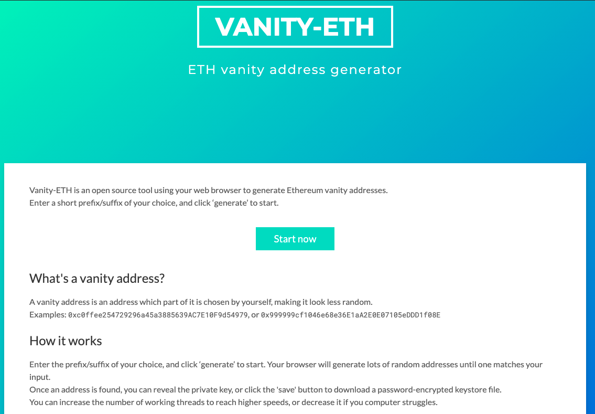

2) กด `Generate` จากนั้น Address หรือ Public Key และ Private key จะถูกสร้างขึ้นมาตามรูป  

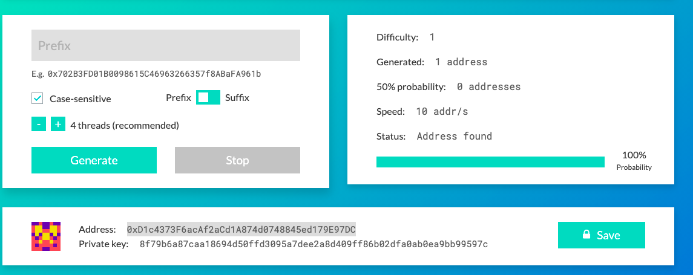

3) save keys  แล้วไปยังเว็บไซต์ 
[testnet.binance.org](https://testnet.binance.org/faucet-smart) จากนั้นคัดลอด และ กรอก address เพื่อขอเหรียญ BNB สำหรับ Test net โดยการคลิก `Give me BNB` ตามรูป 

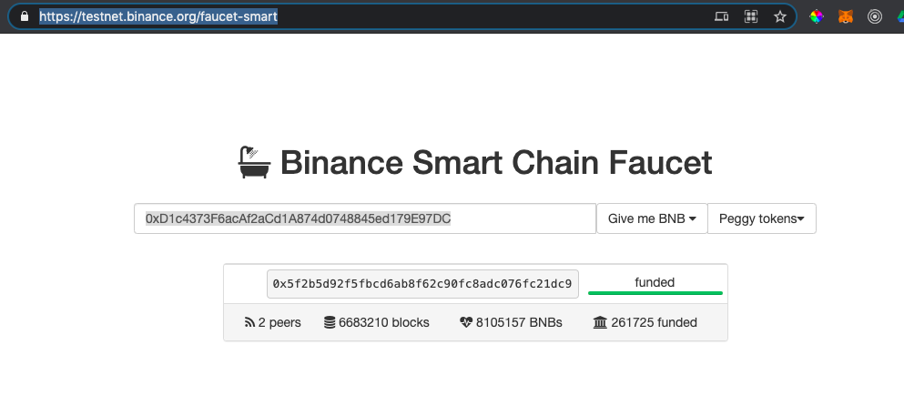

4) สามารถตรวจสอบได้ว่ากระเป๋าเงินของเราได้รับ BNB หรือไม่ โดยการไปยัง 
[Binance Smart Chain Testnet Explorer](https://testnet.bscscan.com/) แล้วค้นหาโดยกรอก Address ของเราลง แล้วคลิกไปตามรูป  

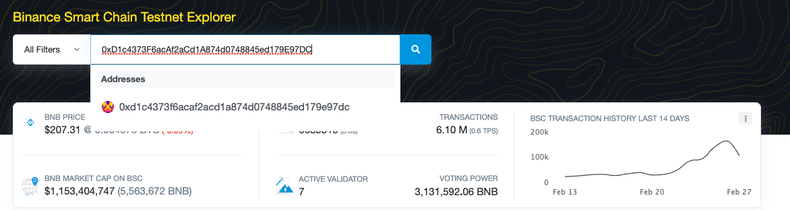

5) หากสำเร็จจะสังเกตเห็นว่าเราจะมีเหรียญ BNB อยู่ไปตามรูป  

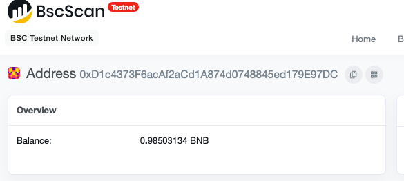

### การใช้ truffle command เพื่อ Deploy smart contract

1) เมื่อมีเหรียญอยู่ในกระเป๋าแล้ว เข้าไปยัง Directory ของโปรเจคที่ต้องการ เช่น 

`cd voting/` หรือ   
`cd opencert-admin/` หรือ   
`cd ethereum-supply-chain/`  
 

2) สร้าง และ/หรือ แก้ไข ไฟลล์ `.env` โดนการกรอก Private key ที่เพิ่งถูกสร้างขึ้นมา ตามรูป 

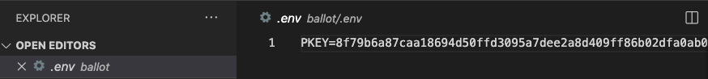

3) Compile และ Deploy smart contracts โดยพิมพ์คำสั่ง  

`truffle migrate --reset --network bscTestnet`  

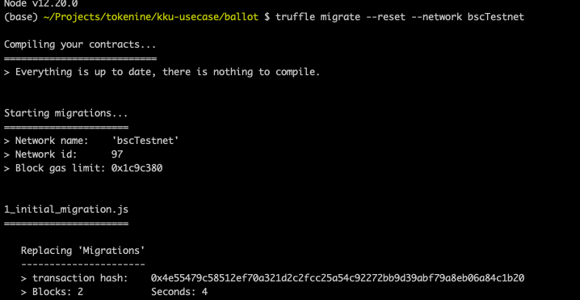

4) หากสำเร็จเมื่อเลื่อนลงไปเราจะเจอ Address ของ Contract ที่ถูก deploy แล้ว ตามรูป (ควรโหลดหรือ save Contract Address ไว้) 

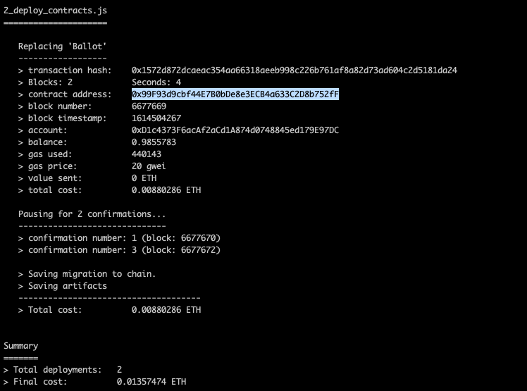

5) สามารถตรวจสอบได้ว่า smart contract ของเราได้ถูก Deploy ไปแล้วหรือไม่ โดยการไปยัง 
[Binance Smart Chain Testnet Explorer](https://testnet.bscscan.com/) แล้วค้นหาโดยกรอก Contract Address จากขั้นตอนที่แล้ว ของเราลงไป หากสำเร็จจะเป็นไปตามรูป  

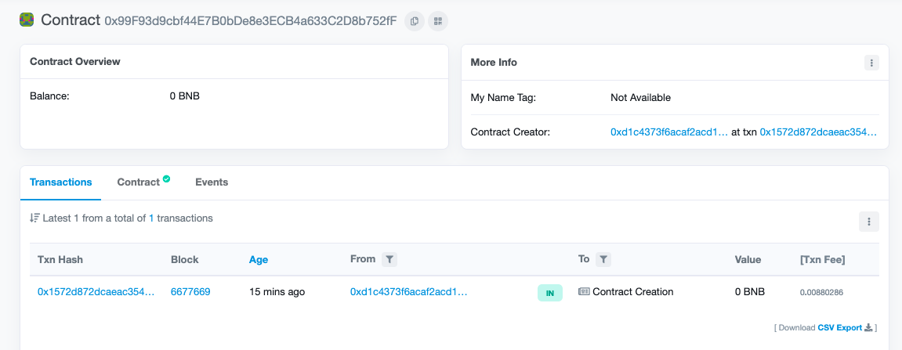

### การใช้ verify และ interact กับ smart contract

5) สามารถ verify smart contract ของเรา เพื่อทำให้เรา interact กับ smart contract ได้ โดยการไปยัง 
[Binance Smart Chain Testnet Explorer](https://testnet.bscscan.com/verifyContract) แล้วค้นหาโดยกรอก Contract Address จากขั้นตอนที่แล้ว ของเราลงไป จากนั้นกรอกตามรูป โดย version ของ compiler สามารถดูได้จาก version ของ compiler ใน truffle-config.js 

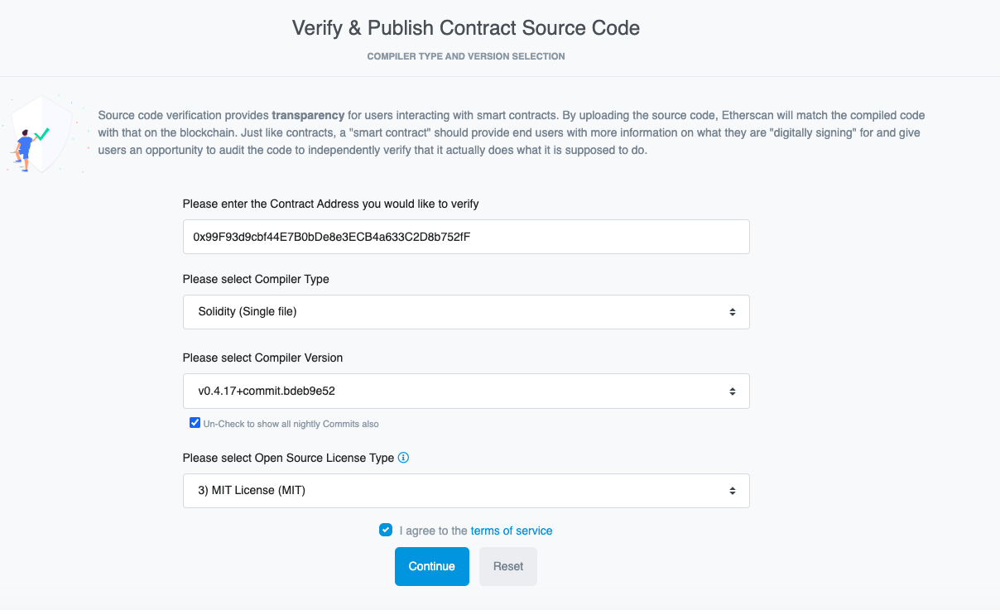
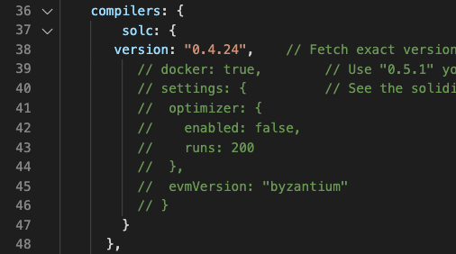

6) กด `Continue` จากนั้นกรอก smart contract source code จาก `/contracts/Ballot.sol` 

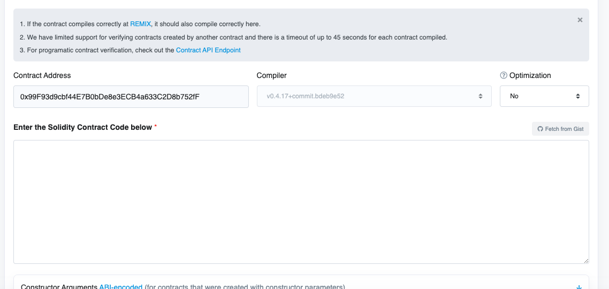

7) หาก verify แล้วเราสามารถ interact กับ smart contract ได้  
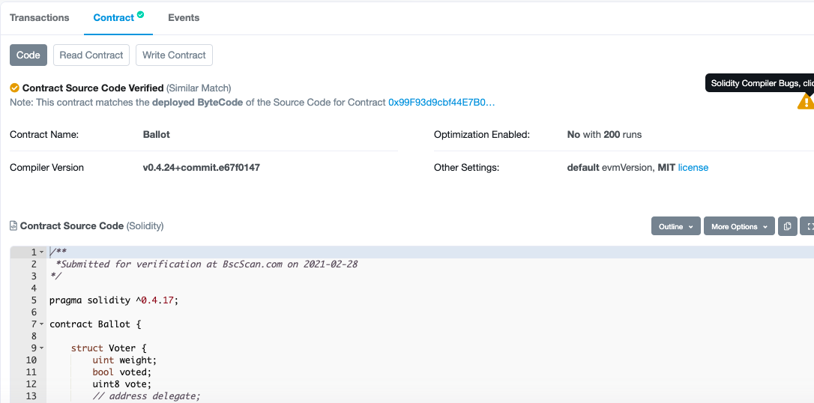

### การใช้งาน

1) ติดตั้ง  [Metamask Chrome Extension](https://chrome.google.com/webstore/detail/metamask/nkbihfbeogaeaoehlefnkodbefgpgknn?hl=en)  

2) กด `Import Account` จากนั้นกรอก Private Key ที่สร้างมาจากขั้นตอนที่แล้ว จาก `/contracts/Ballot.sol` 

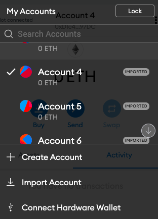

3) กดเลือก Blockchain ที่ต้องการ Network จากนั้นกด `Custom Network` แล้วกรอก config ตามภาพ  

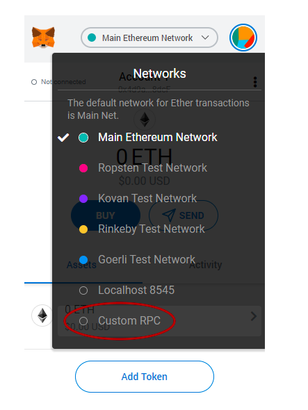

4) เข้าไปยัง client Directory  ของแต่ละโปรเจค เช่น 

`cd ./voting/client` หรือ
`cd ./ethereum-supply-chain/client`   

5) พิมพ์คำสั่ง  

`npm run start`  

6) ไปยัง `http://localhost/3000`  
